  

<h1 align="center">Kaio Silva</h1>

  

  
  
  
  
  
  
   
  
  
  
  
  

## Sobre

Estou migrando de carreira para a tecnologia e curso o Ensino Médio Integrado ao Técnico em Desenvolvimento de Sistemas.
Meu foco é o desenvolvimento **mobile** com React Native e TypeScript, e aprendo na prática: cada conceito novo vira código, e cada projeto me leva ao próximo.

## Estatísticas

  
  

## Atividade

  

 

  
  

